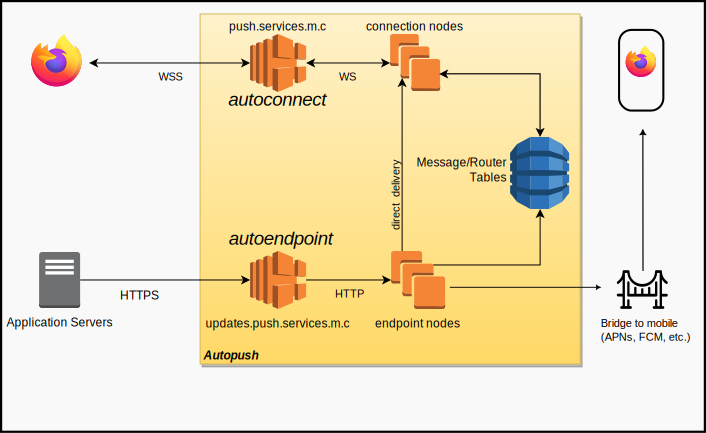

# Architecture



## Overview

For Autopush, we will focus on the section in the above diagram in the
*Autopush* square.

Autopush consists of two types of server daemons:

`autoconnect` (connection node) - _Run a connection node. These handle large amounts of Firefox user agents using the Websocket protocol._

`autoendpoint` (endpoint node) - _Run an endpoint node. These provide a `WebPush` HTTP API for `Application Servers <AppServer>` to HTTP POST messages to endpoints._

To have a running Push Service for Firefox, both of these server daemons
must be running and communicating with the same Storage system and tables.

Endpoint nodes handle all `Notification` POST requests, looking up in
storage to see what Push server the UAID is connected to. The Endpoint
nodes then attempt delivery to the appropriate connection node. If the
UAID is not online, the message may be stored in Storage in the
appropriate message table.

Push connection nodes accept websocket connections (this can easily be
HTTP/2 for WebPush), and deliver notifications to connected clients.
They check Storage for missed notifications as necessary.

There will be many more Push servers to handle the connection node,
while more Endpoint nodes can be handled as needed for notification
throughput.

## Cryptography

The HTTP endpoint URL's generated by the connection nodes contain
encrypted information, the `UAID` and `Subscription` to send the message
to. This means that they both must have the same `CRYPTO_KEY` supplied
to each.

See `autopush_common::endpoint::make_endpoint(...)` for the endpoint
URL generator.

If you are only running Autopush locally, you can skip to `running` as
later topics in this document apply only to developing or production
scale deployments of Autopush.

## Storage Tables

Autopush uses a key / value data storage system. It can either use
AWS DynamoDB (legacy), Google Cloud Bigtable, or a specific combination of the
two.

### DynamoDB (legacy)

For DynamoDB, Autopush used a single router and messages table.
On startup, Autopush created these tables.
For more information on DynamoDB tables, see
<http://docs.aws.amazon.com/amazondynamodb/latest/gettingstartedguide/Welcome.html>

### Google Bigtable

For Bigtable, Autopush presumes
that the table `autopush` has already been allocated, and that the following Cell Families
have been created:

* `message` with a garbage collection policy set to max age of 1 second
* `router` with a garbage collection policy set to max versions of 1
* `message_topic` with a garbage collection policy set to max versions of 1 or max age of 1 second

the following BASH script may be a useful example. It presumes that the [google-cloud-sdk](https://cloud.google.com/cli) has already been installed and initialized.

```bash
PROJECT=test &&\
INSTANCE=test &&\
DATABASE=autopush &&\
MESSAGE=message &&\
TOPIC=message_topic &&\
ROUTER=router &&\
cbt -project $PROJECT -instance $INSTANCE createtable $DATABASE && \
cbt -project $PROJECT -instance $INSTANCE createfamily $DATABASE $MESSAGE && \
cbt -project $PROJECT -instance $INSTANCE createfamily $DATABASE $TOPIC && \
cbt -project $PROJECT -instance $INSTANCE createfamily $DATABASE $ROUTER && \
cbt -project $PROJECT -instance $INSTANCE setgcpolicy $DATABASE $MESSAGE maxage=1s && \
cbt -project $PROJECT -instance $INSTANCE setgcpolicy $DATABASE $TOPIC maxversions=1 or maxage=1s && \
cbt -project $PROJECT -instance $INSTANCE setgcpolicy $DATABASE $ROUTER maxversions=1
```

Please note, this document will refer to the `message` table and the `router` table for
legacy reasons. Please consider these to be the same as the `message` and `router` cell
families.

### Router Table Schema

The router table contains info about how to send out the incoming message.

#### DynamoDB (legacy)

The router table stored metadata for a given `UAID` as well as which
month table should be used for clients with a `router_type` of
`webpush`.

For "[Bridging](install.md#configuring-for-third-party-bridge-services)", additional bridge-specific data may be stored in the
router record for a `UAID`.

|              |                                                                                  |
|--------------|----------------------------------------------------------------------------------|
| uaid         | **partition key** - `UAID`                                                       |
| router_type  | Router Type (See [`autoendpoint::extractors::routers::RouterType`])              |
| node_id      | Hostname of the connection node the client is connected to.                      |
| connected_at | Precise time (in milliseconds) the client connected to the node.                 |
| last_connect | **global secondary index** - year-month-hour that the client has last connected. |
| curmonth     | Message table name to use for storing `WebPush` messages.                        |

Autopush DynamoDB used an optimistic deletion policy for `node_id` to avoid
delete calls when not needed. During a delivery attempt, the endpoint
would check the `node_id` for the corresponding `UAID`. If the client was
not connected, it would clear the `node_id` record for that `UAID` in the
router table.

If an endpoint node discovered during a delivery attempt that the
`node_id` on record did not have the client connected, it would clear
the `node_id` record for that `UAID` in the router table.

The `last_connect` was a secondary global index to allow for
maintenance scripts to locate and purge stale client records and
messages.

Clients with a `router_type` of `webpush` drain stored messages from the
message table named `curmonth` after completing their initial handshake.
If the `curmonth` entry was not the current month then it updated it to
store new messages in the latest message table after stored message
retrieval.

#### Bigtable

The `Router` table is identified by entries with just the `UAID`, containing cells
that are of the `router` family. These values are similar to the ones listed above.

|              |                                                                                  |
|--------------|----------------------------------------------------------------------------------|
| Key          | `UAID`                                                                           |
| router_type  | Router Type (See [`autoendpoint::extractors::routers::RouterType`])              |
| node_id      | Hostname of the connection node the client is connected to.                      |
| connected_at | Precise time (in milliseconds) the client connected to the node.                 |
| last_connect | year-month-hour that the client has last connected.                              |

### Message Table Schema

The message table stores messages for users while they're offline or
unable to get immediate message delivery.

#### DynamoDB (legacy)

|               |                                                                                                                                       |
|---------------|---------------------------------------------------------------------------------------------------------------------------------------|
| uaid          | **partition key** - `UAID`                                                                                                            |
| chidmessageid | **sort key** - `CHID` + `Message-ID`.                                                                                                 |
| chids         | Set of `CHID` that are valid for a given user. This entry was only present in the item when `chidmessageid` is a space.                |
| data          | Payload of the message, provided in the Notification body.                                                                            |
| headers       | HTTP headers for the Notification.                                                                                                    |
| ttl           | Time-To-Live for the Notification.                                                                                                    |
| timestamp     | Time (in seconds) that the message was saved.                                                                                         |
| updateid      | UUID generated when the message was stored to track if the message was updated between a client reading it and attempting to delete it. |

The subscribed channels were stored as `chids` in a record stored with a
blank space set for `chidmessageid`. Before storing or delivering a
`Notification` a lookup was done against these `chids`.

#### Bigtable

|               |                                                                                                                                       |
|---------------|---------------------------------------------------------------------------------------------------------------------------------------|
| Key           | `UAID`#`CHID`#`Message-ID`                                                                                                            |
| data          | Payload of the message, provided in the Notification body.                                                                            |
| headers       | HTTP headers for the Notification.                                                                                                    |
| ttl           | Time-To-Live for the Notification.                                                                                                    |
| timestamp     | Time (in seconds) that the message was saved.                                                                                         |
| updateid      | UUID generated when the message is stored to track if the message is updated between a client reading it and attempting to delete it. |

Autopush used a [table rotation system](table_rotation.md), which is now legacy. You may see some references to this as we continue to remove it.

## Push Characteristics

* When the Push server has sent a client a notification, no further
    notifications will be accepted for delivery (except in one edge
    case). In this state, the Push server will reply to the Endpoint
    with a 503 to indicate it cannot currently deliver the notification.
    Once the Push server has received ACKs for all sent notifications,
    new notifications can flow again, and a check of storage will be
    done if the Push server had to reply with a 503. The Endpoint will
    put the Notification in storage in this case.
* (Edge Case) Multiple notifications can be sent at once, if a
    notification comes in during a Storage check, but before it has
    completed.
* If a connected client is able to accept a notification, then the
    Endpoint will deliver the message to the client completely bypassing
    Storage. This Notification will be referred to as a Direct
    Notification vs. a Stored Notification.
* (_DynamoDb_) Provisioned Write Throughput for the Router table determines how
    many connections per second can be accepted across the entire
    cluster.
* (_DynamoDb_) Provisioned Read Throughput for the Router table **and** Provisioned
    Write throughput for the Storage table determine maximum possible
    notifications per second that can be handled. In theory notification
    throughput can be higher than Provisioned Write Throughput on the
    Storage as connected clients will frequently not require using
    Storage at all. Read's to the Router table are still needed for
    every notification, whether Storage is hit or not.
* (_DynamoDb_) Provisioned Read Throughput on for the Storage table is an important
    factor in maximum notification throughput, as many slow clients may
    require frequent Storage checks.
* If a client is reconnecting, their Router record will be old. Router
    records have the node_id cleared optimistically by Endpoints when
    the Endpoint discovers it cannot deliver the notification to the
    Push node on file. If the conditional delete fails, it implies that
    the client has during this period managed to connect somewhere
    again. It's entirely possible that the client has reconnected and
    checked storage before the Endpoint stored the Notification, as a
    result the Endpoint must read the Router table again, and attempt to
    tell the node_id for that client to check storage. Further action
    isn't required, since any more reconnects in this period will have
    seen the stored notification.

### Push Endpoint Length

The Endpoint URL may seem excessively long. This may seem needless and
confusing since the URL consists of the unique User Agent Identifier
(UAID) and the Subscription Channel Identifier (CHID). Both of these are
class 4 Universally Unique Identifiers (UUID) meaning that an endpoint
contains 256 bits of entropy (2 \* 128 bits). When used in string
format, these UUIDs are always in lower case, dashed format (e.g.
`01234567-0123-abcd-0123-0123456789ab`).

Unfortunately, since the endpoint contains an identifier that can be
easily traced back to a specific device, and therefore a specific user,
there is the risk that a user might inadvertently disclose personal
information via their metadata. To prevent this, the server obscures the
UAID and CHID pair to prevent casual determination.

As an example, it is possible for a user to get a Push endpoint for two
different accounts from the same User Agent. If the UAID were disclosed,
then a site may be able to associate a single user to both of those
accounts. In addition, there are reasons that storing the UAID and CHID
in the URL makes operating the server more efficient.

Naturally, we're always looking at ways to improve and reduce the length
of the URL. This is why it's important to store the entire length of the
endpoint URL, rather than try and optimize in some manner.
