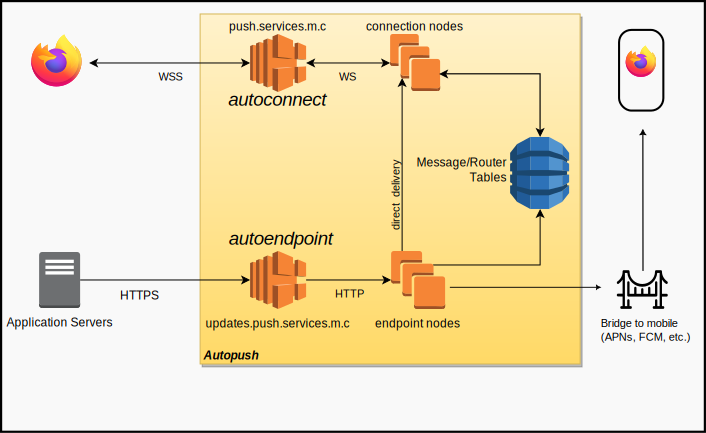

# Architecture



For the implementation-level connection, notification, and storage paths, see
the [developer onboarding chapter](onboarding/index.md). This page retains some
historical DynamoDB context; the onboarding chapter documents the current Rust
and Bigtable behavior.

## Overview

For Autopush, we will focus on the section in the above diagram in the
*Autopush* square.

Autopush consists of two types of server daemons:

`autoconnect` (connection node) - _Run a connection node. These handle large amounts of Firefox user agents using the Websocket protocol._

`autoendpoint` (endpoint node) - _Run an endpoint node. These provide a `WebPush` HTTP API for `Application Servers <AppServer>` to HTTP POST messages to endpoints._

To have a running Push Service for Firefox, both of these server daemons
must be running and communicating with the same Storage system and tables.

Endpoint nodes handle all `Notification` POST requests, looking up in
storage to see what Push server the UAID is connected to. The Endpoint
nodes then attempt delivery to the appropriate connection node. If the
UAID is not online, the message may be stored in Storage in the
appropriate message table.

Push connection nodes accept WebSocket connections and deliver notifications
to connected desktop clients. They check Storage for missed notifications as
necessary.

There will be many more Push servers to handle the connection node,
while more Endpoint nodes can be handled as needed for notification
throughput.

## Cryptography

The HTTP endpoint URL's generated by the connection nodes contain
encrypted information, the `UAID` and `Subscription` to send the message
to. This means that they both must have the same `CRYPTO_KEY` supplied
to each.

See `autopush_common::endpoint::make_endpoint(...)` for the endpoint
URL generator.

If you are only running Autopush locally, you can skip to `running` as
later topics in this document apply only to developing or production
scale deployments of Autopush.

## WebPush Sort Keys

The current Bigtable row-key suffix identifies the message kind:

```text
01:{CHID}:{TOPIC}                  replaceable Topic message
02:{MILLISECOND-TIMESTAMP}:{CHID} ordinary timestamped message
```

Both are prefixed by the 32-character, non-hyphenated UAID and `#`. A stable
Topic key allows a newer message for the same UAID, CHID, and Topic to replace
the pending row. The opaque `version` value stored in the row is the message ID
used for client delivery and publisher cancellation; it is not part of the
ordinary row key.

## Storage Tables

Autopush uses Google Cloud Bigtable as a key / value data storage system.

### DynamoDB (legacy)

Previously, for DynamoDB, Autopush used a single router and messages table.
On startup, Autopush created these tables.
For more information on DynamoDB tables, see
<http://docs.aws.amazon.com/amazondynamodb/latest/gettingstartedguide/Welcome.html>

### Google Bigtable

For Bigtable, Autopush presumes
that the table `autopush` has already been allocated, and that the following Cell Families
have been created:

* `message` with a garbage collection policy of max age 1 second **or** max
  versions 1;
* `message_topic` with the same policy;
* `router` with max versions 1;
* `reliability` with max age 1 second **or** max versions 1.

Message and reliability cells use future timestamps to turn the one-second age
policy into their effective TTL. For the full explanation, see
[Bigtable data model](onboarding/bigtable.md#message-expiry-mechanism).

The repository setup script is the maintained example. It presumes that the
[google-cloud-sdk](https://cloud.google.com/cli) has been installed and
initialized:

```bash
export BIGTABLE_EMULATOR_HOST=localhost:8086
sh scripts/setup_bt.sh test test
```

Please note, this document will refer to the `message` table and the `router` table for
legacy reasons. Please consider these to be the same as the `message` and `router` cell
families.


### Router Table Schema

The router table contains info about how to send out the incoming message.

#### DynamoDB (legacy)

The router table stored metadata for a given `UAID` as well as which
month table should be used for clients with a `router_type` of
`webpush`.

For "[Bridging](install.md#configuring-for-third-party-bridge-services)", additional bridge-specific data may be stored in the
router record for a `UAID`.

|              |                                                                                  |
|--------------|----------------------------------------------------------------------------------|
| uaid         | **partition key** - `UAID`                                                       |
| router_type  | Router Type (See [`autoendpoint::extractors::routers::RouterType`])              |
| node_id      | Hostname of the connection node the client is connected to.                      |
| connected_at | Precise time (in milliseconds) the client connected to the node.                 |
| last_connect | **global secondary index** - year-month-hour that the client has last connected. |
| curmonth     | Message table name to use for storing `WebPush` messages.                        |

Autopush DynamoDB used an optimistic deletion policy for `node_id` to avoid
delete calls when not needed. During a delivery attempt, the endpoint
would check the `node_id` for the corresponding `UAID`. If the client was
not connected, it would clear the `node_id` record for that `UAID` in the
router table.

If an endpoint node discovered during a delivery attempt that the
`node_id` on record did not have the client connected, it would clear
the `node_id` record for that `UAID` in the router table.

The `last_connect` was a secondary global index to allow for
maintenance scripts to locate and purge stale client records and
messages.

Clients with a `router_type` of `webpush` drain stored messages from the
message table named `curmonth` after completing their initial handshake.
If the `curmonth` entry was not the current month then it updated it to
store new messages in the latest message table after stored message
retrieval.

#### Bigtable

The `Router` table is identified by entries with just the `UAID`, containing cells
that are of the `router` family. These values are similar to the ones listed above.

| Field | Meaning |
|---|---|
| Key | The 32-character, non-hyphenated `UAID`. |
| `router_type` | `webpush`, `fcm`, `apns`, or a legacy/test value. |
| `router_data` | Optional router-specific JSON, including native tokens and application data for mobile clients. |
| `node_id` | Internal URL of the autoconnect process that most recently registered a desktop UAID. It may be stale. |
| `connected_at` | Millisecond timestamp used to resolve concurrent connection updates. |
| `current_timestamp` | Cursor after the last fully ACKed ordinary-message batch. |
| `record_version` | Data-model version. |
| `version` | Random UUID used for optimistic conditional updates. |
| `chid:<uuid>` | Empty-valued set-membership cell for a subscription channel. |

### Message Table Schema

The message table stores messages for users while they're offline or
unable to get immediate message delivery.

#### DynamoDB (legacy)

|               |                                                                                                                                       |
|---------------|---------------------------------------------------------------------------------------------------------------------------------------|
| uaid          | **partition key** - `UAID`                                                                                                            |
| chidmessageid | **sort key** - `CHID` + `Message-ID`.                                                                                                 |
| chids         | Set of `CHID` that are valid for a given user. This entry was only present in the item when `chidmessageid` is a space.                |
| data          | Payload of the message, provided in the Notification body.                                                                            |
| headers       | HTTP headers for the Notification.                                                                                                    |
| ttl           | Time-To-Live for the Notification.                                                                                                    |
| timestamp     | Time (in seconds) that the message was saved.                                                                                         |
| updateid      | UUID generated when the message was stored to track if the message was updated between a client reading it and attempting to delete it. |

The subscribed channels were stored as `chids` in a record stored with a
blank space set for `chidmessageid`. Before storing or delivering a
`Notification` a lookup was done against these `chids`.

#### Bigtable

| Field | Meaning |
|---|---|
| Key, ordinary | `{uaid-simple}#02:{millisecond-sort-timestamp}:{hyphenated-chid}`. |
| Key, Topic | `{uaid-simple}#01:{hyphenated-chid}:{topic}`. A later publication for this tuple overwrites the pending row. |
| `data` | Base64URL form of the already encrypted notification body. |
| `headers` | JSON containing the content-encoding and encryption metadata needed by Firefox. |
| `ttl` | Effective message TTL in seconds. |
| `timestamp` | Original publication time in Unix seconds. |
| `version` | Opaque message ID sent to Firefox and returned in the publisher `Location` header. |
| `reliability_id`, `reliable_state` | Optional reliability-reporting fields. |

Autopush used a [table rotation system](table_rotation.md), which is now legacy. You may see some references to this as we continue to remove it.

## Push Characteristics

* A connection node has a bounded in-process channel for each connected UAID.
  Multiple direct notifications can be queued and tracked while waiting for
  ACKs. If the UAID is absent or that channel cannot accept the command, the
  current internal route returns `404`, not `503`.
* Internal `PUT /push/{uaid}` and `PUT /notif/{uaid}` return `200` once the
  process-local command is queued. This is not proof of a WebSocket write,
  Bigtable read, or Firefox ACK.
* Direct desktop delivery avoids an initial **message-row write**, but it does
  not bypass Bigtable entirely: autoendpoint reads the router row and channel
  set before routing every valid desktop publication.
* Autoconnect keeps non-zero-TTL direct notifications in memory until ACK. If
  the connection closes first, shutdown recovery writes them to Bigtable.
  TTL-zero direct delivery is intentionally best-effort.
* Stored notifications are sent in small batches. Autoconnect waits for all
  outstanding direct and stored ACKs before advancing to another stored batch.
  Topic ACKs delete the row; ordinary ACKs advance `current_timestamp`, and
  the rows remain until TTL garbage collection.
* (_DynamoDb (legacy)_) Provisioned Write Throughput for the Router table determines how
    many connections per second can be accepted across the entire
    cluster.
* (_DynamoDb (legacy)_) Provisioned Read Throughput for the Router table **and** Provisioned
    Write throughput for the Storage table determine maximum possible
    notifications per second that can be handled. In theory notification
    throughput can be higher than Provisioned Write Throughput on the
    Storage as connected clients will frequently not require using
    Storage at all. Read's to the Router table are still needed for
    every notification, whether Storage is hit or not.
* (_DynamoDb (legacy)_) Provisioned Read Throughput on for the Storage table is an important
    factor in maximum notification throughput, as many slow clients may
    require frequent Storage checks.
* A request/transport error while calling a connection node conditionally
  clears `node_id`. A reachable node's non-`200` response currently does not,
  so `node_id` is a route worth trying rather than proof of a live socket.
* After storing a notification, autoendpoint reads the router row again and,
  if the UAID reconnected during the write, asks its node to check storage.
  This closes the store-versus-reconnect race.

### Push Endpoint Length

The Endpoint URL may seem excessively long. This may seem needless and
confusing since the URL consists of the unique User Agent Identifier
(UAID) and the Subscription Channel Identifier (CHID). Both of these are
class 4 Universally Unique Identifiers (UUID) meaning that an endpoint
contains 256 bits of entropy (2 \* 128 bits). When used in string
format, these UUIDs are always in lower case, dashed format (e.g.
`01234567-0123-abcd-0123-0123456789ab`).

Unfortunately, since the endpoint contains an identifier that can be
easily traced back to a specific device, and therefore a specific user,
there is the risk that a user might inadvertently disclose personal
information via their metadata. To prevent this, the server obscures the
UAID and CHID pair to prevent casual determination.

As an example, it is possible for a user to get a Push endpoint for two
different accounts from the same User Agent. If the UAID were disclosed,
then a site may be able to associate a single user to both of those
accounts. In addition, there are reasons that storing the UAID and CHID
in the URL makes operating the server more efficient.

Naturally, we're always looking at ways to improve and reduce the length
of the URL. This is why it's important to store the entire length of the
endpoint URL, rather than try and optimize in some manner.
