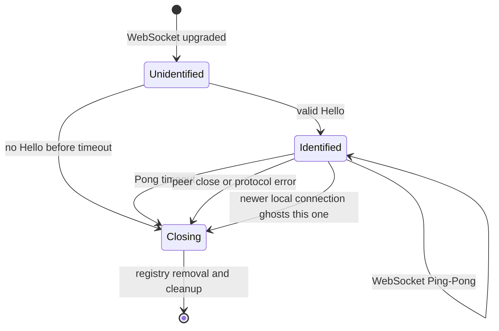

# Desktop connection lifecycle

This page follows one desktop Firefox WebSocket. Mobile devices do not use this
connection path; see [Actors, services, and registration](actors-and-services.md#mobile-registration).

## State transitions



The I/O loop waits on three independent inputs:

1. WebSocket frames from Firefox;
2. internal notifications from the per-process client registry;
3. the server Ping/Broadcast timer.

This matters operationally: an internal `PUT /push/{uaid}` can be accepted by
the process while the connection is concurrently closing. Shutdown cleanup is
responsible for preserving a non-zero-TTL message in that race.

## Handshake and connection setup

The default settings in `autoconnect-settings/src/lib.rs` are:

| Setting | Default | Meaning |
|---|---:|---|
| `open_handshake_timeout` | 5 seconds | Maximum wait for the first `hello` text message. |
| `auto_ping_interval` | 300 seconds | How often autoconnect checks an otherwise idle connection. |
| `auto_ping_timeout` | 4 seconds | How long Firefox has to answer a WebSocket Ping with a Pong. |
| `client_channel_capacity` | 128 | Per-client in-process queue for direct notifications/check-storage commands. |
| `msg_limit` | 150 | Maximum stored notifications read in one connection before the UAID is reset. |

After Hello succeeds, the client is inserted into a process-local registry:

```text
UAID -> { session UID, bounded notification sender }
```

If the same UAID connects again to the same process, the new registry entry
replaces the old one and sends the old session a `Disconnect` command. The
session UID prevents cleanup from the old connection from deleting the new
registry entry.

## What is kept for an active connection?

The `WebPushClient` state exists only in the autoconnect process:

- UAID and a process-local session UID;
- parsed browser/OS information from the WebSocket `User-Agent` header;
- broadcast subscriptions;
- connection flags and the last client-level Ping time;
- the Bigtable `current_timestamp` cursor read at Hello;
- full copies of sent-but-unacknowledged direct and stored notifications;
- the highest storage timestamp currently being processed;
- session counters such as direct ACKs, stored ACKs, NACKs, registrations, and
  messages recovered to storage.

Bigtable does **not** contain a row per live socket. The persistent router row
contains only enough information to find and validate the UAID: notably
`node_id`, `connected_at`, router type/data, channels, and the storage cursor.

## Idle connections and Ping behavior

An idle connection is not closed merely because it has no notification
traffic. Normally, after `auto_ping_interval`, autoconnect sends a WebSocket
Ping frame and waits `auto_ping_timeout` for a Pong. A missing Pong closes the
session with a Pong-timeout error.

When a Megaphone broadcast change is pending, the timer sends a Web Push
`broadcast` text message instead of the WebSocket Ping. A broadcast does not
expect a Pong; liveness is tested on a later Ping interval.

Firefox may also send the application-level `{"messageType":"ping"}` (or
`{}`). This is distinct from WebSocket Ping/Pong. Autoconnect replies with `{}`
but treats another application-level Ping within 45 seconds as excessive and
closes the session.

## What happens on timeout or disconnect?

All identified-session exits run the same broad cleanup:

1. Remove the session from the process-local registry, but only if its session
   UID still owns the UAID entry.
2. Drain direct notifications still queued in the registry receiver into the
   unacknowledged-direct map.
3. For every unacknowledged direct notification with non-zero TTL, start an
   asynchronous Bigtable save.
4. Read the router row again. If the UAID reconnected elsewhere after this
   session began, notify the new `node_id` to check storage.
5. Emit connection-lifespan metrics and one `Session` summary log.

TTL-zero direct notifications are intentionally not retained in the
unacknowledged map. They are best-effort: if the connection disappears after
the internal node accepted them but before Firefox receives them, they are
lost.

### A stale `node_id` is expected

Normal WebSocket shutdown does not clear `node_id` in Bigtable. The row can
temporarily point at a process that no longer has the connection.

On the next publication, autoendpoint tries that node. If the internal request
itself fails (for example, a connect error or timeout), autoendpoint
conditionally removes `node_id` using the router-row version and then stores
the message. The conditional update avoids erasing a newer route if the client
reconnected during the race.

There is an important current edge case: if the node is reachable but returns
`404 Client not available`, autoendpoint stores the message but does not clear
`node_id`. Subsequent publications can therefore keep trying that stale node
until a reconnect or another operation updates/removes the router row.

Treat `node_id` as a route worth trying, not proof of an active socket.

## How browser and operating-system information is known

### Desktop

The WebSocket upgrade's `User-Agent` header is parsed with Woothee into browser
name/version, OS/version, category, and bounded-cardinality metric families.
That parsed object stays in connection memory and is used in metrics, the final
session log, and Sentry context.

It is not stored in the Bigtable router or message families. After the session
log is gone, Bigtable alone cannot tell you the exact browser version or OS of
a desktop UAID.

### Mobile

Authenticated mobile registration-management requests also parse their HTTP
`User-Agent`. The daily channel-list request logs browser/OS details and emits
normalized metrics while refreshing the user record. These details are not
written to Bigtable either.

The Bigtable `router_type` and mobile `router_data` can distinguish WebPush,
FCM, and APNs and identify a configured mobile app/release channel. They are
not a reliable substitute for an OS/browser version.

### Publishers

The `User-Agent` on `POST /wpush/...` belongs to the publisher. It says nothing
about the receiving user agent. Likewise, the encrypted endpoint token contains
UAID, CHID, and possibly a VAPID-key digest, but no browser or OS field.

## Code map

| Behavior | Primary code |
|---|---|
| Capture WebSocket User-Agent | `autoconnect/autoconnect-ws/src/lib.rs` |
| Handshake timeout and three-input loop | `autoconnect/autoconnect-ws/src/handler.rs` |
| Ping/Pong timer | `autoconnect/autoconnect-ws/src/ping.rs` |
| Process-local UAID registry | `autoconnect/autoconnect-common/src/registry.rs` |
| Per-connection state and shutdown | `autoconnect/.../autoconnect-ws-sm/src/identified/mod.rs` |
| UA parsing | `autopush-common/src/util/user_agent.rs` |
