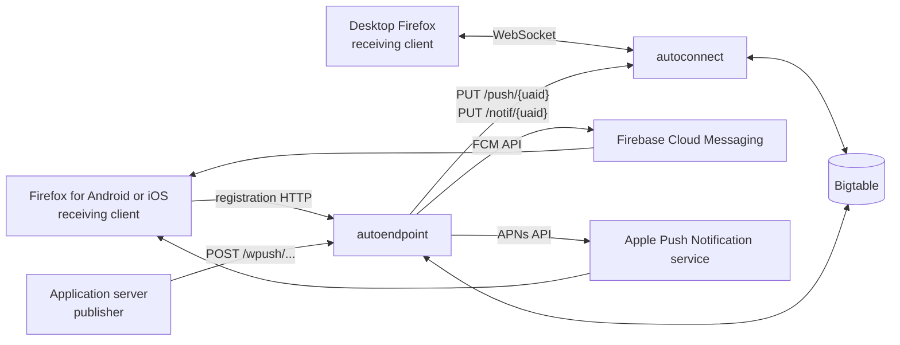

# Autopush developer onboarding

This chapter explains the current Rust implementation from the outside in:
who calls Autopush, which service accepts each call, how a notification moves
through the system, what lives in memory, and what is persisted in Bigtable.

It was verified against Autopush `1.82.2` at commit `ab80b71` on 2026-07-14.
The implementation and integration tests are the source of truth when this
chapter and older architecture documents disagree.

## The shortest useful mental model

Autopush has two public-facing Rust services:

- **autoconnect** holds long-lived WebSocket connections from desktop Firefox.
- **autoendpoint** accepts push publications and mobile registration calls.

There are three kinds of external actor:

- A **desktop Firefox Push user agent** connects to autoconnect and registers
  Web Push subscriptions over that WebSocket.
- A **mobile Firefox push component** registers its FCM or APNs device token
  with autoendpoint. FCM or APNs owns the long-lived connection to the device.
- An **application server**, also called a publisher, sends an HTTPS `POST` to
  the opaque endpoint URL belonging to a subscription.

For desktop delivery, autoendpoint reads Bigtable even when the receiving
Firefox is currently online. It must resolve the encrypted subscription token,
validate the channel, and find the autoconnect node holding that UAID. Bigtable
is therefore both a routing database and an offline queue, not merely a queue.

## Read this chapter in order

1. [Actors, services, and registration](actors-and-services.md) explains who
   calls which API and how a subscription is created.
2. [Desktop connection lifecycle](connection-lifecycle.md) follows a WebSocket
   from handshake through idle detection and disconnect cleanup.
3. [Notification lifecycle](notification-lifecycle.md) follows one publication
   through validation, direct delivery, storage, retry, and acknowledgement.
4. [Bigtable data model](bigtable.md) lists every row family, important cell,
   and read/write path.
5. [Observing and debugging](observing-and-debugging.md) maps lifecycle stages
   to metrics, logs, and code.
6. [Developer workflow](developer-workflow.md) contains a small verified local
   setup and test guide.

## Terms used throughout

| Term | Meaning in this codebase |
|---|---|
| UA | A receiving Push client. For the WebSocket path this is desktop Firefox. |
| UAID | A UUID identifying one Push user-agent record. It is not an account ID. |
| CHID | A UUID identifying one subscription channel belonging to a UAID. |
| Publisher | The application server that owns a subscription endpoint and sends a notification. |
| Push endpoint | An opaque HTTPS URL containing an encrypted UAID and CHID, plus a VAPID-key digest for v2 endpoints. |
| VAPID | Voluntary Application Server Identification: a signed publisher identity for Web Push. It authenticates the application server; it does not encrypt the notification. |
| Direct message | A desktop notification queued to a connected autoconnect process without first writing the message to Bigtable. |
| Stored message | A desktop notification written to Bigtable for later retrieval. |
| Router record | The Bigtable row that describes a UAID, its channels, and how to route to it. |
| Topic message | A replaceable notification: a later message with the same UAID, CHID, and Topic replaces the pending one. |

The encrypted notification payload remains opaque to Autopush. Autopush
validates its envelope and transports the encrypted bytes; the receiving
client has the content-decryption key.
