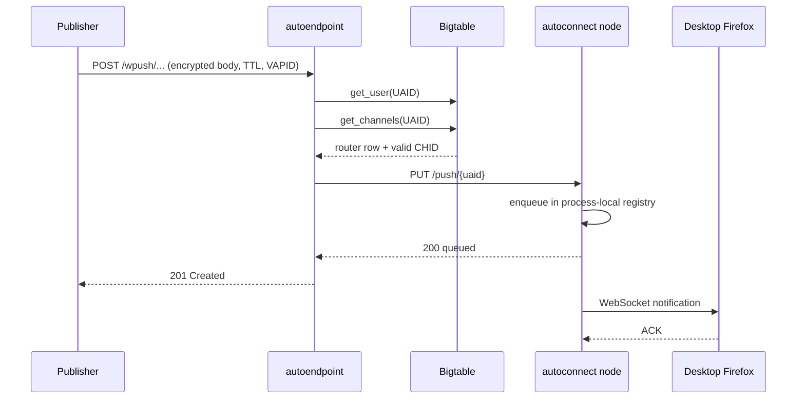
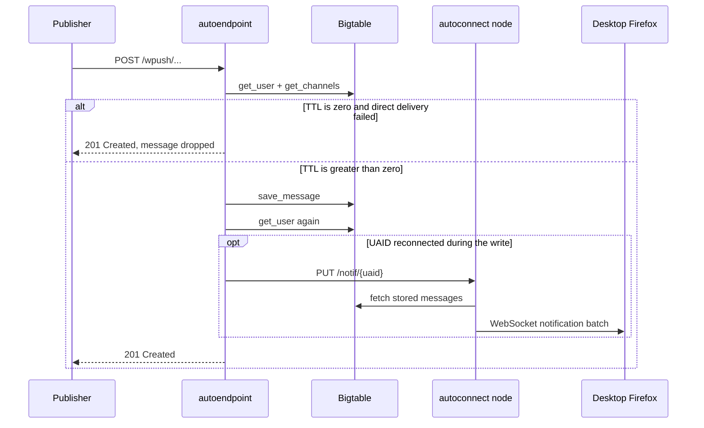

# Notification lifecycle

This page follows a new push message from the publisher to a desktop or mobile
receiving client.

## 1. A publisher sends a notification

The publisher makes an HTTPS request to the opaque endpoint returned when the
subscription was registered:

```text
POST /wpush/v1/{fernet-token}
POST /wpush/v2/{fernet-token}
```

Important request information includes:

| Input | Meaning and handling |
|---|---|
| Endpoint token | Decrypts to UAID + CHID. A v2 token also contains the digest of the VAPID public key bound at registration. |
| `TTL` | Required, non-negative, and silently capped at `max_notification_ttl` (30 days by default). |
| `Topic` | Optional, maximum 32 URL-safe Base64 characters. Selects replaceable storage. |
| `Authorization` / `Crypto-Key` | Optional [VAPID publisher authentication](actors-and-services.md#what-vapid-is-and-is-not) and public-key material. VAPID is validated before routing; v2 endpoints require the bound key. |
| HTTP body | Already encrypted by the publisher. Autoendpoint Base64URL-encodes the bytes for JSON transport/storage but cannot decrypt the content. |
| Content-encryption headers | `Content-Encoding` plus the draft-dependent `Encryption`, `Encryption-Key`, or `Crypto-Key` values needed by Firefox. |

Autoendpoint then performs the subscription lookup:

1. Decrypt and validate the endpoint token.
2. Validate VAPID, including the v2 key binding when present.
3. Read the UAID's router row with `get_user`.
4. For `router_type=webpush`, separately read `chid:*` cells with
   `get_channels` and verify the CHID.
5. Read the body and encryption headers.
6. Generate a Fernet-encrypted message ID containing UAID, CHID, and either
   Topic or the millisecond sort timestamp.

The separate `get_user` and `get_channels` calls currently mean a valid desktop
publication usually reads the same Bigtable router row twice. Mobile
publications do not perform the desktop channel-set check in `validate_user`.

## 2. autoendpoint selects a router

The router row's `router_type` selects one implementation:

- `webpush`: desktop autoconnect delivery with Bigtable fallback;
- `fcm`: Firebase Cloud Messaging;
- `apns`: Apple Push Notification service;
- `gcm`: legacy and rejected/removed;
- `stub`: test builds only.

## Desktop: direct path



If the router row has a `node_id`, autoendpoint serializes the notification and
sends it to that autoconnect process's internal `PUT /push/{uaid}` route.

The node returns `200` when it successfully enqueues the notification in the
bounded process-local channel. This does **not** mean the WebSocket write has
completed and does not mean Firefox ACKed it. Nevertheless, autoendpoint then
returns `201 Created` to the publisher.

Autoconnect sends the notification over the WebSocket and retains a full
in-memory copy when TTL is non-zero. An ACK removes that direct copy. If the
session closes first, shutdown cleanup stores it in Bigtable and, if necessary,
pokes a newer connection to check storage.

For TTL zero, autoconnect does not retain the in-memory recovery copy. This is
intentional best-effort delivery.

## Desktop: store-and-forward path

Autoendpoint falls back to storage when there is no `node_id`, the internal
node cannot be reached, the UAID is absent from that node's registry, or its
per-client queue is full. A request/transport failure conditionally clears the
route. A normal HTTP error response such as the node's `404 Client not
available` currently does not clear it.



After writing, autoendpoint reads the router row again. This closes a race in
which Firefox reconnects while the message is being stored. If a new `node_id`
is present, `PUT /notif/{uaid}` tells that process to check Bigtable.

As with the direct internal route, a `200` from `/notif/{uaid}` only means the
process-local check-storage command was queued. The subsequent Bigtable read,
WebSocket write, and Firefox ACK are separate events.

If no connection exists, the next successful Hello for that UAID initiates the
same storage check.

### Reading stored messages

Autoconnect reads replaceable topic messages first and ordinary timestamped
messages second. The implementation retrieves small batches (up to 11 topic
rows and 10 timestamp rows per query), filters expired messages, sends a batch,
and waits until all outstanding stored and direct notifications are ACKed
before advancing to another batch.

- ACKed **topic** messages are explicitly deleted.
- ACKed **ordinary timestamp** messages are not deleted. Once the batch is
  fully ACKed, autoconnect advances `current_timestamp` in the router row so
  those rows are not returned again. Physical GC removes them after their
  original TTL.
- A NACK records a metric but does not remove the notification from ACK
  tracking. It therefore remains unacknowledged for recovery/redelivery.
- If more than `msg_limit` stored messages are read during the connection, the
  router user is deleted and the UAID is reset rather than draining an
  unbounded backlog.

## Mobile: provider handoff

For FCM and APNs, autoendpoint uses the native token and configured app/release
channel from `router_data` and sends the encrypted Web Push envelope to the
provider.

- FCM receives the device registration token, bounded TTL, CHID, encrypted
  body, and encryption metadata.
- APNs receives the device token, expiration, configured topic/APS data, CHID,
  encrypted body, metadata, and message version.

A successful provider response means FCM/APNs accepted the request. Autopush
does not receive the desktop-style application ACK and does not store the
mobile message body in Bigtable for retry.

If a provider reports that the recipient token is gone, autoendpoint removes
the Bigtable user/router row. Other bridge failures are returned to the
publisher; the message is not moved into the desktop offline queue.

## Failure and response semantics

| Event | Result |
|---|---|
| Malformed endpoint, missing/invalid TTL, bad encryption envelope, bad VAPID, missing user, or invalid CHID | HTTP error; no message storage. |
| Desktop internal request fails, TTL > 0 | Conditionally clear stale `node_id`, then store in Bigtable. |
| Desktop node returns non-200 (including absent/full), TTL > 0 | Store in Bigtable; the current code leaves `node_id` unchanged. |
| Desktop internal node unavailable/absent/full, TTL = 0 | Drop and return a successful `201` response. |
| Bigtable save fails | Publication fails; autoendpoint does not claim durable acceptance. |
| Internal node accepted, then WebSocket closes before ACK | autoconnect asynchronously stores non-zero-TTL direct messages. |
| Firefox ACKs a direct message | Remove the in-memory recovery copy. |
| Firefox ACKs a stored topic message | Delete its Bigtable row. |
| Firefox ACKs stored ordinary messages | Advance the logical cursor after the complete batch; rows remain until TTL GC. |
| Publisher sends `DELETE /m/{message_id}` | Delete the corresponding message row if it exists. |
| FCM/APNs accepts | Return `201`; provider acceptance is the final Autopush handoff. |
| FCM/APNs says recipient is gone | Remove the router user and return a terminal error such as Gone. |

The publisher-facing `201` therefore means that Autopush accepted the
publication according to the selected route. It is not a universal end-device
delivery receipt.

## Code map

| Stage | Primary code |
|---|---|
| Public publication route | `autoendpoint/src/routes/webpush.rs` |
| Token/VAPID/subscription validation | `autoendpoint/src/extractors/subscription.rs` |
| TTL, Topic, and encryption headers | `autoendpoint/src/extractors/notification_headers.rs` |
| Message construction | `autoendpoint/src/extractors/notification.rs` |
| Desktop direct/store routing | `autoendpoint/src/routers/webpush.rs` |
| Internal autoconnect routes | `autoconnect/autoconnect-web/src/routes.rs` |
| Direct send and storage reads | `autoconnect/.../identified/on_server_notif.rs` |
| ACK, cursor advancement, NACK | `autoconnect/.../identified/on_client_msg.rs` |
| FCM handoff | `autoendpoint/src/routers/fcm/router.rs` |
| APNs handoff | `autoendpoint/src/routers/apns/router.rs` |
