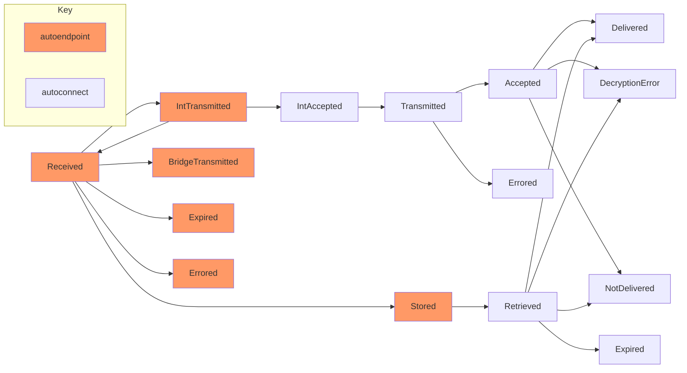

# Push Reliability Tracking

AutoPush does a lot to ensure that messages and subscriptions stay private. There are many reasons for this, aside from simply respecting user privacy, which include the high cost of data capture and retention. Tracking this information can easily increase costs by thousands of dollars a month.

Traditionally, AutoPush has relied on "external" tracking to determine how reliably it can deliver a message. "External" in this case, means a Mozilla internal group that tracks how "successful" a Send Tab to Device is. There are some complications with this, as that group has a different qualification for "success" than AutoPush does (delivery within a very short timeframe). Autopush should be able to determine if there are any points of loss internally without incurring the sizable costs for full tracking.

This can be done via sampling, but it's important to only sample push messages that have agreed to this. Fortunately, we can use those same Mozilla generated and consumed push notification messages for "Send Tab". (The action of sending a tab is done by the user, but the use of the AutoPush system is an internal detail. It would be like tracking a dollar bill through a vending machine. We don't know or care who put the bill into the machine, nor do we care what they purchased. We are only watching to make sure the bill doesn't get stuck or fall out somewhere.)

## Configuration

In order to start the process, the AutoEndpoint configuration file gets a list of VAPID public keys to look for. The key format is not a standard PEM format, so the `convert_pem_to_x962.py` file is used to convert the public key format to something that's more scan-able.

That key is registered using the `autoendpoint.tracking_keys` configuration setting.

Push Reliability requires a Redis like memory storage system to manage the various milestone transactions. Milestones are tracked using two internal stores, the first being a Hash Incrementor (HINCR) "state_counts" table, which records the count of message at a given state. and an "expiry" table to record the expiration timestamp for the subscription.

Push Reliablity also includes a bigtable `reliability` column family, which is used to create a long term record which can be used for more "in depth" analysis of a given message's path.

## Operation

If an incoming subscription is validated and contains a matching VAPID public key, then a `reliability_id` is assigned to the message. This ID is a random UUID that is attached to the message. All tracking is tied to this ID alone, and only performed if the `reliable_report` feature is enabled in the code.

Various milestones have been set along a given messages path. These are defined in `autopush_common::reliability::PushReliabilityState`. Their valid state transistions:

When a message transitions from one state to the next, the new `state_count` is incremented, and the old `state_count` is decremented. In addition, the "expiry" table which is a scored hash table records the message expiration. The "expiry" table uses a combo of the "`state`#`reliability_id`" as the key. with the expiration timestamp as the value. This table is scanned by the separate `scripts/reliability_cron.py` script, which looks for expired keys, decrements their counts, and logs the expired status to bigtable. This script is required because there are no known data stores that provide this function automatically (recommendations are very welcome). The use of an outside script is to ensure that only a single application decrements values and logs data, preventing possible race conditions.

"Live" counts can be displayed using any tool that can read the Redis data store, or the AutoEndpoint `/__milestones__` endpoint can be queried. Historical tracking is not part of this, and should be done using external tooling and the `reliability_cron.py` script.

## Data Retention

Push Subscpritions have a maximum lifetime of 30 days. The Redis Reliability tracking information will last as long as the message TTL. The Bigtable Reliability Log information will be retained for twice the maximum subscription lifetime, of 60 days to allow for some longer term trend analysis. (Note, this reliability information does not have any record of the user, subscription provider, or message content. It only includes the milestone, and timestamp when the message crossed that milestone.)
